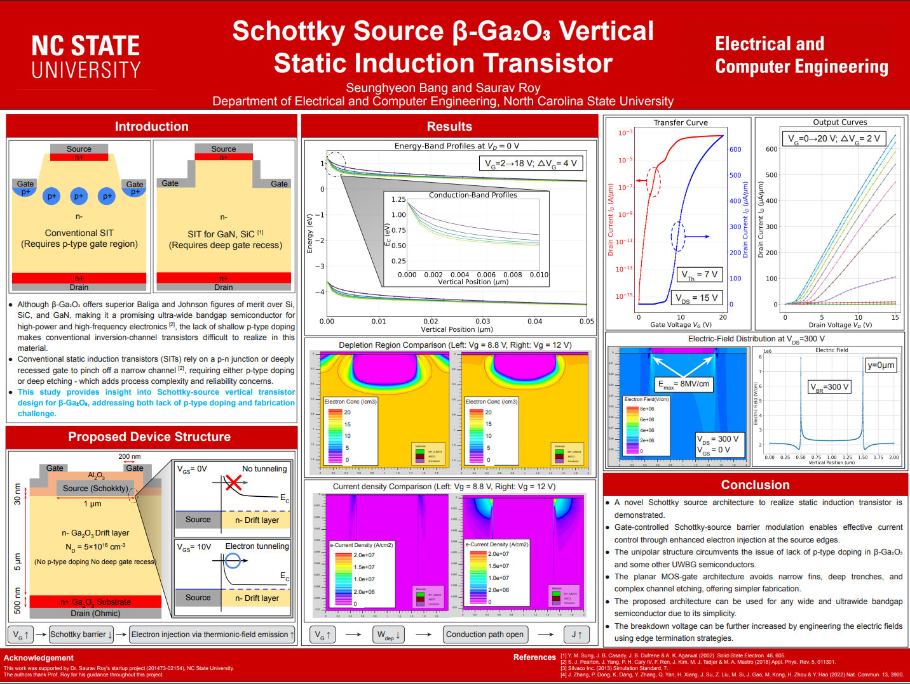

# Schottky-Source β-Ga₂O₃ Vertical Static Induction Transistor

A SILVACO ATLAS TCAD study of a **Schottky-source vertical static induction transistor (SIT)** based on β-Ga₂O₃.

The proposed device uses gate-controlled Schottky-barrier modulation to regulate electron injection from the source. This architecture avoids the shallow p-type doping and deep gate recesses normally required in conventional SIT structures, making it especially attractive for ultra-wide-bandgap semiconductors such as β-Ga₂O₃.

<p align="center">
  
</p>

## Project Overview

β-Ga₂O₃ is a promising ultra-wide-bandgap semiconductor for high-voltage and high-frequency electronics because of its large bandgap and high critical electric field. However, the lack of practical p-type doping makes conventional inversion-channel and p–n-junction-based devices difficult to realize.

This project investigates a vertical SIT architecture that replaces the conventional p-type gate region with:

- A Schottky source contact
- Two planar MOS gates
- Gate overlap near the source edges
- An n-type β-Ga₂O₃ drift region
- An ohmic n+ drain contact

The gate voltage controls the width of the depletion region and the effective Schottky tunneling barrier at the source edges.

## Device Structure

Key simulated device parameters include:

| Parameter | Value |
|---|---:|
| Semiconductor | β-Ga₂O₃ |
| Schottky source width | 1 μm |
| Gate dielectric | Al₂O₃ |
| Gate dielectric thickness | 30 nm |
| Gate overlap near source | 200 nm |
| Drift-layer thickness | 5 μm |
| Drift-layer doping | 5 × 10¹⁶ cm⁻³ |
| n+ substrate thickness | 500 nm |
| Drain contact | Ohmic |
| Gate structure | Planar MOS gate |
| p-type region | Not required |
| Deep gate recess | Not required |

## Operating Principle

At low gate voltage, the Schottky barrier suppresses electron injection from the source into the β-Ga₂O₃ drift layer.

As the gate voltage increases:

1. The conduction band near the source edges bends downward.
2. The effective Schottky barrier becomes thinner.
3. Thermionic-field emission and electron tunneling increase.
4. The gate-controlled depletion width decreases.
5. A vertical conduction path opens through the drift region.
6. The drain current increases.

In compact form:

\[
V_G \uparrow
\rightarrow
W_{\mathrm{dep}} \downarrow
\rightarrow
\text{Schottky barrier width} \downarrow
\rightarrow
\text{electron injection} \uparrow
\rightarrow
I_D \uparrow
\]

The current-density simulations show that electron injection is concentrated near the source edges, where the MOS gates most strongly modulate the Schottky barrier.

## TCAD Analysis

The repository includes simulations and data associated with:

- Device structure generation
- Energy-band profiles
- Conduction-band profiles near the source
- Electron-concentration distributions
- Depletion-region modulation
- Current-density distributions
- Transfer characteristics
- Output characteristics
- Electric-field distributions
- Breakdown-voltage analysis
- Gate-voltage and drain-voltage sweeps

## Key Results

### Transfer Characteristics

At \(V_{DS}=15\text{ V}\), the simulated device shows:

- Threshold voltage of approximately **7 V**
- Strong gate-controlled turn-on
- A large increase in drain current after the source barrier becomes sufficiently thin

### Output Characteristics

The output curves were simulated for:

\[
V_G = 0\text{–}20\text{ V}, \qquad \Delta V_G = 2\text{ V}
\]

The device exhibits SIT-like, largely non-saturating output behavior. At high gate voltage, the simulated drain current reaches approximately **650 μA/μm at \(V_D=15\text{ V}\)**.

### Depletion and Current-Density Modulation

Comparisons at \(V_G=8.8\text{ V}\) and \(V_G=12\text{ V}\) show that:

- The depletion region contracts as gate voltage increases.
- The vertical conduction path becomes more open.
- Current density rises significantly near both source edges.
- The two planar gates provide symmetric control of source injection.

### Breakdown and Electric Field

At \(V_{DS}=300\text{ V}\) and \(V_{GS}=0\text{ V}\):

- Simulated breakdown voltage is approximately **300 V**
- Maximum electric field is approximately **8 MV/cm**
- Peak electric fields occur near the source/gate-edge regions

Further improvement may be possible through edge termination and electric-field engineering.

## Main Contributions

- Demonstrates a Schottky-source approach for realizing a vertical SIT in β-Ga₂O₃.
- Avoids the need for practical p-type doping.
- Eliminates narrow fins, deep trenches, and complex channel etching.
- Uses planar MOS gates to control source-barrier tunneling.
- Provides gate-controlled current modulation through thermionic-field emission.
- Offers a concept that may be extended to other wide- and ultra-wide-bandgap semiconductors.

## Software

- **SILVACO DeckBuild**
- **SILVACO ATLAS**
- **SILVACO TonyPlot**
- Python or other plotting tools may be used for post-processing exported simulation data.

## Running the Simulations

1. Open the desired ATLAS input deck in SILVACO DeckBuild.
2. Run the structure-generation or electrical-sweep deck.
3. Open generated `.str` files in TonyPlot to inspect the device structure, electric field, carrier concentration, and current density.
4. Open generated `.log` files to inspect transfer, output, and breakdown characteristics.
5. Export numerical data for additional plotting or comparison when needed.

Because file names and directory organization may change as the project develops, refer to the comments inside each input deck for its sweep conditions and output files.

## Poster

The full research poster is included as [`poster.png`](poster.png).

**Title:** Schottky Source β-Ga₂O₃ Vertical Static Induction Transistor  
**Authors:** Seunghyeon Bang and Saurav Roy  
**Affiliation:** Department of Electrical and Computer Engineering, North Carolina State University

## Citation

When referencing this project, please cite:

```text
S. Bang and S. Roy, “Schottky Source β-Ga₂O₃ Vertical Static Induction
Transistor,” Department of Electrical and Computer Engineering,
North Carolina State University, 2026.
```

## Acknowledgment

This work was supported by Prof. Saurav Roy's startup project at North Carolina State University. The author thanks Prof. Roy for his guidance throughout the project.

## Disclaimer

This repository presents a TCAD-based research study. The reported characteristics are simulation results and do not represent fabricated-device measurements.
